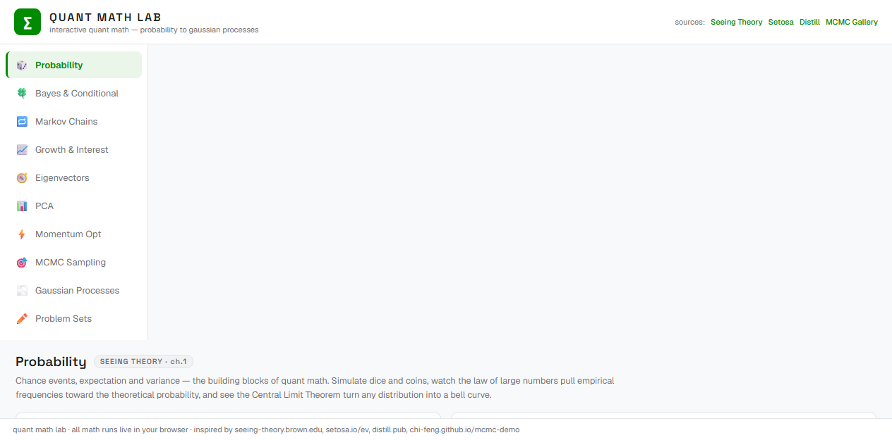

# quant-math-lab

[](LICENSE)
[](https://scar8969.github.io/quant-math-lab/)
[](js/)

**Live demo: [scar8969.github.io/quant-math-lab](https://scar8969.github.io/quant-math-lab/)**



Interactive quant math learning lab — 10 visual modules + auto-graded problem sets, built from scratch after scraping the best educational math sites on the web.

---

## What's inside

| # | Module | Source | What you do |
|---|--------|--------|-------------|
| 1 | **Probability** | Seeing Theory | Roll dice, simulate CLT, shade normal curves |
| 2 | **Bayes & Conditional** | Setosa | Drag Venn diagrams, see P(B\|A) flip, medical test trap |
| 3 | **Markov Chains** | Setosa | Edit transition matrix, watch convergence to stationary π |
| 4 | **Growth & Interest** | Setosa | Compare linear vs exponential, compound interest, SIR model |
| 5 | **Eigenvectors** | Setosa | Drag v, see Av, eigenspaces, Fibonacci via matrix powers |
| 6 | **PCA** | Setosa | Drag points, PC axes swing to chase variance, 1-D projection |
| 7 | **Momentum Opt** | Distill | GD vs momentum vs Nesterov on contour plots |
| 8 | **MCMC Sampling** | MCMC Gallery | Metropolis / MALA / HMC on 2-mode target, acceptance rates |
| 9 | **Gaussian Processes** | Distill | Click to add data, posterior snaps, RBF / Matern kernels |
| 10 | **Problem Sets** | — | 54 auto-graded derivation problems, tolerance-checked, timed mode |

### Auto-graded problem sets
- 54 parameterized problems across all topics — fresh random numbers every time
- 0.1% tolerance numeric grading with an expression parser (`1/3`, `sqrt(2)`, `2^3`, `pi`, `e`)
- Timed speed round: 60s, +1 correct / -1 wrong, random mixed topics
- Progress tracking with streaks, saved in localStorage

## How it works

Zero dependencies. One HTML shell, one CSS file, 11 vanilla JS files. All math runs live in your browser — canvas rendering, matrix decompositions, Cholesky solves, MCMC samplers, GP posteriors.

```bash
# local dev
cd quant-math-lab
python -m http.server 8899
# open http://127.0.0.1:8899
```

Or just hit the [live demo](https://scar8969.github.io/quant-math-lab/).

## Sources

| Source | Link |
|--------|------|
| Seeing Theory | [seeing-theory.brown.edu](https://seeing-theory.brown.edu/) |
| Setosa — Explained Visually | [setosa.io/ev](https://setosa.io/ev/) |
| Distill — Why Momentum Really Works | [distill.pub/2017/momentum](https://distill.pub/2017/momentum/) |
| Distill — Gaussian Processes | [distill.pub/2019/visual-exploration-gaussian-processes](https://distill.pub/2019/visual-exploration-gaussian-processes/) |
| MCMC Interactive Gallery | [chi-feng.github.io/mcmc-demo](https://chi-feng.github.io/mcmc-demo/) |

## License

MIT — see [LICENSE](LICENSE)